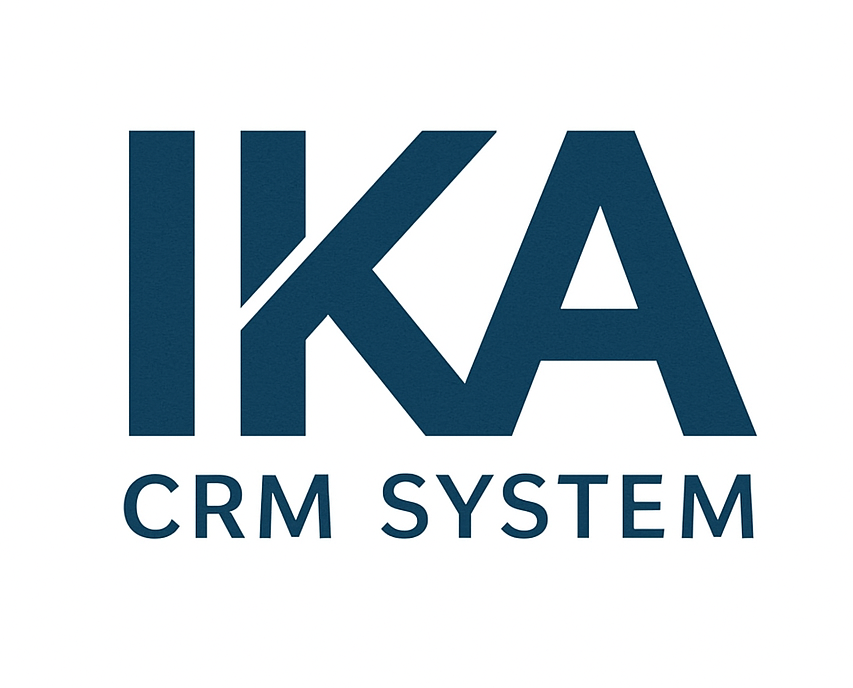
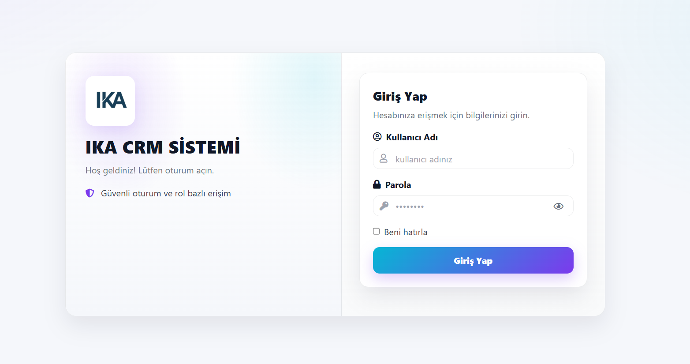
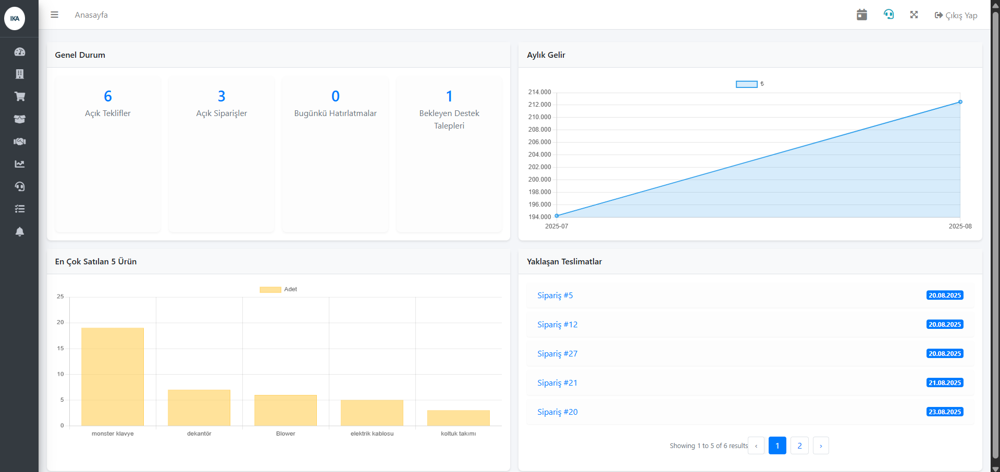
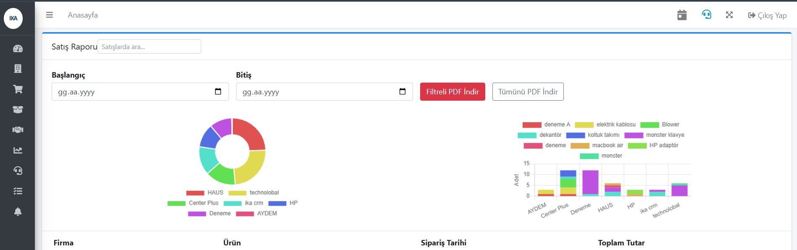
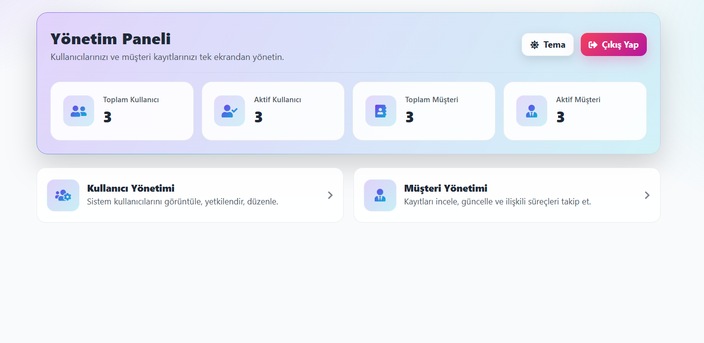

<!-- Logo -->
<p align="center">
  
</p>


<p align="center">
  <b>Endüstriyel & Tekstil Odaklı <br> Yeni Nesil Modüler CRM Uygulaması</b><br><br>
  
  Gücünü <b>Laravel (PHP)</b> altyapısından alan, modern <b>HTML/CSS/JavaScript</b> arayüzü ve <b>MySQL</b> veritabanı ile desteklenen <b>IKA CRM System</b>,  
  işletmelerin tüm kritik süreçlerini tek bir merkezde toplar.  

  <br>

  🚀 <b>Şirketler</b>, <b>Kişiler</b>, <b>Teklifler</b>, <b>Siparişler</b>, <b>Ürünler</b>, <b>Seri Numaraları</b>, <b>Cari Hesap Hareketleri</b>, <b>Destek Talepleri</b> ve <b>Aksiyon/Hatırlatıcılar</b> gibi  
  iş akışlarını <u>tam entegre ve modüler</u> şekilde yönetir.  

  <br>

  📊 Akıllı <b>dashboard</b> panelleri, <b>grafikli raporlar</b> ve <b>PDF çıktıları</b> ile yöneticilere <u>anlık görünürlük</u> ve <u>hızlı karar alma</u> imkânı sağlar.  
  Esnek tasarımı sayesinde her ölçekten işletmeye uyarlanabilir.  

  <br>

  🔒 <b>Güvenlik, hız ve kullanıcı deneyimi</b> odaklı tasarlanan bu sistem, endüstriyel/tekstil sektörünün yanı sıra farklı sektörlere de ölçeklenebilir bir çözüm sunar.  
</p>

---

<p align="center">
  <a href="#-özellikler"></a>
  <a href="#-ekip--katkı-rolleri"></a>
  <a href="#-teknoloji-yığını"></a>
  <a href="#-kurulum-hızlı-başlangıç"></a>
  <a href="#-yol-haritası-roadmap"></a>
  <a href="#-lisans-license"></a>
</p>


---

## 🚀 Özellikler

### 🔐 Kimlik Doğrulama / Yönetim
- **Ayrı giriş & paneller:** Admin ve Kullanıcı için **ayrı login akışları** ve **farklı paneller** (oturum izolasyonu).
- **Middleware altyapısı:** Rol/izin kontrolü için **policy/gate** temelli katman; admin rotaları için özel middleware (örn. `IsAdmin`, `RedirectIfAdmin`).
- **RBAC temeli:** Rol-bazlı yetkilendirme, modül/aksiyon seviyesinde izin denetimi.
- **Modern deneyim:** Şifre göster/gizle, *loading* durumları, başarım/geri bildirim iletileri.
- **Liste deneyimi:** **Canlı arama (JS)**, yaygın filtreler, sayfalama.

### 🧩 İş Modülleri
- **Çekirdek modüller:** `Şirketler`, `Kişiler`, `Teklifler`, `Siparişler`, `Ürünler`, `ÜrünSeri/SiparişSeri`, `Cari Hesaplar & Hareketler`, `Raporlar`, `Destek`, `Aksiyon`, `Hatırlatıcı`.
- **Sektör uyumu:** Tekstil/endüstriyel kullanım için **seri/lot/renk/termin** alanları; **ürün–seri** ve **sipariş–seri** takibi.
- **İhtiyaca göre ölçeklenir:** Modülleri **aktif/pasif** edebilme, alanları **ihtiyaca göre özelleştirme**.
- **Dinamik araçlar:** Hızlı filtreler, toplu işlemler, **Excel/CSV dışa aktarma**, **PDF çıktıları**, anlık bildirim/tetikleyiciler.

### 📊 Dashboard (İş Verimini Artıran Paneller)
- **Anlık sayaçlar:** Açık **Teklif/Sipariş**, **Bugünkü Hatırlatmalar**, **Bekleyen Destek Talepleri**.
- **Operasyon görünümü:**
  - **Yaklaşan teslimler** (termin takvimi, gecikme uyarıları)
  - **Düşük stok/Kritik ürün** uyarıları
  - **Tahsilat/Ödeme** özetleri (cari hareketleri nabzı)
  - **Satış hunisi & KPI’lar** (dönüşüm, ort. teklif tutarı, sipariş hızı)
  - **Destek/SLA** panosu (open/pending/resolved)
- **Hızlı aksiyonlar:** Tek tıkla **Yeni Teklif**, **Yeni Sipariş**, **Yeni Hatırlatma**; son aktiviteler akışı.

> İhtiyaca göre bu paneller ayrı bölümler halinde daha da detaylandırılabilir.

### 🎨 Tasarım (UI/UX Notları)
- **Tutarlı tasarım dili:** Bileşen-tabanlı arayüz, okunaklı tipografi, net boşluk kullanımı.
- **Responsive:** Masaüstü/tablet/mobil uyumlu grid yapıları.
- **Kullanılabilirlik:** Klavyeyle gezinme, erişilebilirlik (a11y) odağı, açıklayıcı durum/boş ekran mesajları.
- **Performans pratikleri:** Lazy load, akıllı sayfalama, hafif JS etkileşimleri.
- **Tema/markalama:** Kurumsal renkler ve ikonografiyle tutarlılık (opsiyonel: **açık/koyu tema**).

---

## 👥 Ekip & Katkı Rolleri

| İkon | İsim | Rol |
|---|---|---|
| 🧑‍💻 | **Orhan Kutay Bozkurt** | Front-End / Full-Stack Developer |
| 🖥️ | **İlker Akbal** | Backend / Full-Stack Developer |
| 🧑‍💻 | **Ahmet Usta** | Full-Stack Developer |
| 🧪 | **Meşkure Demir** | QA / Tester |
 

---

## 🏷️ Proje Logosu ve Anlamı
IKA CRM System logosu, ana geliştiriciler **İ**lker, **K**utay ve **A**hmet’in baş harflerinden oluşur.  
Logo; endüstriyel/tekstil odaklı şirket süreçlerini tek noktada **bütünleştirme ve uyumu** simgeler.

---

## 🧩 Problem / Çözüm
**Sektör Sorunları:**  
- Sipariş, müşteri ve stok süreçlerinin manuel yürütülmesi  
- Verilerin farklı sistemlerde tutulması  
- Rapor/analiz süreçlerinin zaman alması  

**Çözüm:**  
- Süreçlerin tek dijital platformda toplanması  
- Hızlı ve entegre raporlama, PDF çıktıları  
- Modern, responsive arayüz  

---

## 🎯 Kullanıcıya Sunduğumuz Değer
- Tek panelden tüm süreç yönetimi  
- Görsel dashboard ile hızlı analiz  
- Filtrelenebilir PDF raporları  
- Hatırlatma ve bildirim sistemi  
- Güvenilir veri akışı  

---

## 📈 Somut Katkılar
| Katkı Alanı | Sonuç |
|-------------|-------|
| Süreçlerin dijitalleşmesi | %30 daha az manuel iş |
| Raporlama/analiz optimizasyonu | Dakikalar içinde sonuç |
| Kullanıcı dostu arayüz | Hızlı adaptasyon |
| Ölçülebilir süreçler | Daha hızlı karar alma |
| Hatırlatma sistemi | Daha yüksek etkileşim |

---

## 🛠️ Teknoloji Yığını

| Katman       | Teknoloji / Araçlar                  |
|--------------|--------------------------------------|
| **Backend**  | PHP (Laravel Framework)              |
| **Frontend** | Blade Template Engine, HTML, CSS, JavaScript, Vite |
| **Veritabanı** | MySQL / MariaDB                    |
| **Raporlama** | dompdf (PDF), QuickChart (Grafik)   |
| **Paket Yöneticileri** | Composer, npm             |
| **Versiyon Kontrol** | Git                          |
| **Ortam** | Localhost (php artisan serve)  |


---

## ⚙️ Kurulum (Hızlı Başlangıç)
bash
# 1) Repo klonla
git clone https://github.com/<kullanici>/<repo>.git
cd <repo>

# 2) PHP bağımlılıklarını yükle (Composer)
composer install

# 3) Ortam dosyasını ayarla
cp .env.example .env
php artisan key:generate

# 4) Veritabanı oluştur ve migrate
php artisan migrate --seed   # (seed varsa)
# veya sadece
php artisan migrate

# 5) Storage link
php artisan storage:link

# 6) Node bağımlılıklarını yükle ve derle
npm install
npm run dev     # geliştirme
# npm run build # production için

# 7) Sunucu başlat
php artisan serve

---

## 📁 Proje Yapısı
```text
app/                        # Laravel uygulama ana dizini
  ├─ Console/               # Artisan komutları
  ├─ Exceptions/            # Özel exception sınıfları
  ├─ Http/                  
  │   ├─ Controllers/       # Controller katmanı
  │   ├─ Middleware/        # Middleware sınıfları
  │   └─ Requests/          # Form Request validasyonları
  ├─ Models/                # Eloquent modelleri
  └─ Mail/                  # Mail sınıfları (Mailable)

bootstrap/                  # Framework bootstrap dosyaları
  └─ cache/                 # Cachelenen framework dosyaları

config/                     # Uygulama yapılandırma dosyaları

crm-projesi/                # (Senin eklediğin özel modül/klasör)

database/
  ├─ factories/             # Model factory’ler
  ├─ migrations/            # Veritabanı tablolarını oluşturan migration dosyaları
  └─ seeders/               # Örnek veri yükleme (seeder) dosyaları

public/                     
  ├─ images/                # Statik görseller (örn: logo.png)
  └─ index.php              # Uygulama giriş noktası

resources/
  ├─ css/                   # CSS (Vite ile derlenen)
  ├─ js/                    # JavaScript dosyaları
  ├─ lang/                  # Dil dosyaları
  └─ views/                 # Blade view şablonları

routes/                     
  ├─ api.php                # API rotaları
  ├─ web.php                # Web rotaları
  └─ console.php            # Artisan komut rotaları

storage/
  ├─ app/                   # Kullanıcı dosyaları
  ├─ framework/             # Cache, session, views
  └─ logs/                  # Log dosyaları (laravel.log)

tests/
  ├─ Feature/               # Feature testleri
  └─ Unit/                  # Unit testleri

vendor/                     # Composer bağımlılıkları

.env                        # Ortam değişkenleri
.env.example                # Örnek ortam dosyası
artisan                     # Artisan komut dosyası
composer.json               # Composer bağımlılık tanımı
composer.lock               # Composer bağımlılık kilit dosyası
package.json                # NPM bağımlılıkları
package-lock.json           # NPM bağımlılık kilit dosyası

```

---

## 🧭 Teknik Mimari
- MVC (Laravel)  
- Blade template engine  
- MySQL veritabanı  

---

## 🖼️ Uygulama Görselleri

### 🔐 Kullanıcı Giriş Ekranı
<p align="center">
  
</p>
<p align="center"><i>Kullanıcı Giriş Ekranı – Güvenli oturum ve rol bazlı erişim</i></p>

---

### 📊 Dashboard
<p align="center">
  
</p>
<p align="center"><i>Dashboard – Anlık sayaçlar, KPI’lar ve operasyonel görünürlük</i></p>

---

### 📑 Raporlama & PDF Çıktısı
<p align="center">
  
</p>
<p align="center"><i>Raporlama – Grafikler, PDF çıktıları ve özelleştirilebilir filtreler</i></p>

---

### 🗂️ Admin Panel
<p align="center">
  
</p>
<p align="center"><i>Admin Panel – Yönetici yetkileri, kullanıcı & rol yönetimi</i></p>


## 🗺️ Yol Haritası

### 🌍 Çoklu Dil Desteği
- [ ] Uygulamanın farklı dillerde kullanılabilmesi (tr/en başta olmak üzere)  
- [ ] Dil dosyaları (`resources/lang/`) üzerinden yönetilebilir yapı  
- [ ] Kullanıcı bazlı dil seçimi  

### 🔗 Entegrasyon (Dış Araç Erişimi)
- [ ] **Outlook entegrasyonu:** e-posta/sunum akışıyla CRM kayıtlarına bağlama (teklif/sipariş/kişi eşleştirme)
- [ ] **Gmail (opsiyonel):** benzer e-posta → CRM ilişkilendirme
- [ ] **REST API / OAuth2 (JWT):** harici istemcilerden (web/mobil/desktop) IKA CRM’e güvenli erişim
- [ ] **Takvim senkronu:** Outlook/Google Calendar ile hatırlatma & aksiyon planlarının eşitlemesi
- [ ] **Dosya paylaşımı (opsiyonel):** OneDrive/Drive ile teklif & rapor çıktılarının senkronu

### 🛠️ Sistem Çözümleri 
- [ ] Docker ortamı (kolay kurulum & dağıtım)  
- [ ] CI/CD pipeline (GitHub Actions/GitLab CI ile otomasyon)  
- [ ] Performans optimizasyonu (cache, queue, indexing)  


---

## 📜 Lisans
MIT License
